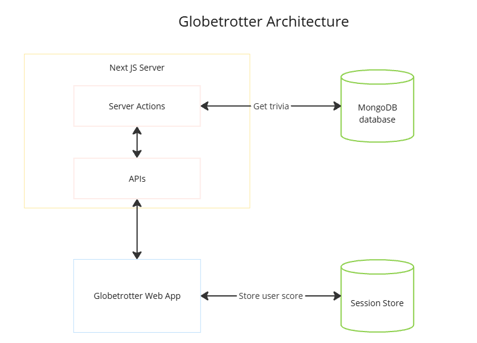

# Globetrotter - Explore the World Through Trivia

Expand your global knowledge with our fun and engaging trivia app. Learn interesting facts about cities and countries while challenging your friends.

Live Demo: https://globetrotter-quiz.vercel.app

## Features
- <b>Learn Through Play:</b> Test your geography knowledge with fun and engaging trivia questions about cities around the world.
- <b>Instant Feedback:</b> Get immediate feedback after each answer, including a fun fact about the featured city.
- <b>Track Your Progress:</b> See your score at the end of each quiz and strive for improvement.
- <b>Play Again:</b> Challenge yourself to beat your high score with unlimited retries.
- <b>Share Your Success:</b> Share your quiz results easily via QR code, WhatsApp link, or a customizable web link optimized for social media.

## Architecture
The application's architecture is a three-tiered structure. The user interface is built using React and Ant Design, a component library, within the Next.js framework. Next.js handles routing and server-side rendering. Data is stored and retrieved from a MongoDB database.

The user's quiz score is tracked and temporarily stored in session storage. When the user creates an invite challenge, a new user account is created, and the score is saved permanently in the database. A unique shareable link, incorporating the user's score, is then generated.

    
    

        Application Architecture
    

## Dataset Creation
Generated a large array of data from a sample set using Tadashi: https://github.com/RyanDC1/Tadashi-Generative-AI to generate a list of values suitable for the app.

## APIs
The APIs are built using Next.js Server Actions, enabling server-side data fetching and processing. This approach ensures data security and enhances performance by handling API requests to the database directly on the server.

## Setup
- Add the required environment variables in the .env file
- run pnpm i
- run pnpm dev